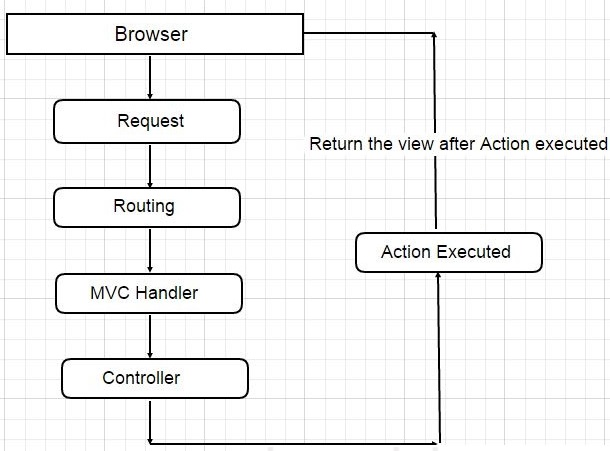

# Cách ASP.NET 1 và 2 hoạt động



The following lists the stages of execution for an MVC Web project:

- Receive first request for the application
  - In the Global.asax file, **Route** objects are added to the **RouteTable** object.
- Perform routing
  - The **UrlRoutingModule** module uses the first matching **Route** object in the **RouteTable** collection to create the **RouteData** object, which it then uses to create a **RequestContext** (**IHttpContext**) object.
- Create MVC request handler
  - The **MvcRouteHandler** object creates an instance of the **MvcHandler** class and passes it the **RequestContext** instance.
- Create controller
  - The **MvcHandler** object uses the **RequestContext** instance to identify the **IControllerFactory** object (typically an instance of the **DefaultControllerFactory** class) to create the controller instance with.
- Execute controller - The **MvcHandler** instance calls the controller s **Execute** method. |
- Invoke action
  - Most controllers inherit from the **Controller** base class. For controllers that do so, the **ControllerActionInvoker** object that is associated with the controller determines which action method of the controller class to call, and then calls that method.
- Execute result
  - A typical action method might receive user input, prepare the appropriate response data, and then execute the result by returning a result type. The built-in result types that can be executed include the following: **ViewResult** (which renders a view and is the most-often used result type), **RedirectToRouteResult**, **RedirectResult**, **ContentResult**, **JsonResult**, and **EmptyResult**.


Lần đầu tiên có request tơi, MVC sẽ chạy file Global.asax. 

```C#
using System;
using System.Collections.Generic;
using System.Linq;
using System.Web;
using System.Web.Mvc;
using System.Web.Routing;

namespace MvcApplication1
{
    // Note: For instructions on enabling IIS6 or IIS7 classic mode, 
    // visit https://go.microsoft.com/?LinkId=9394801

    public class MvcApplication : System.Web.HttpApplication
    {
        public static void RegisterRoutes(RouteCollection routes)
        {
            routes.IgnoreRoute("{resource}.axd/{*pathInfo}");

            routes.MapRoute(
                "Default",                                              // Route name
                "{controller}/{action}/{id}",                           // URL with parameters
                new { controller = "Home", action = "Index", id = "" }  // Parameter defaults
            );

        }

        protected void Application_Start()
        {
            RegisterRoutes(RouteTable.Routes);
        }
    }
}
```

